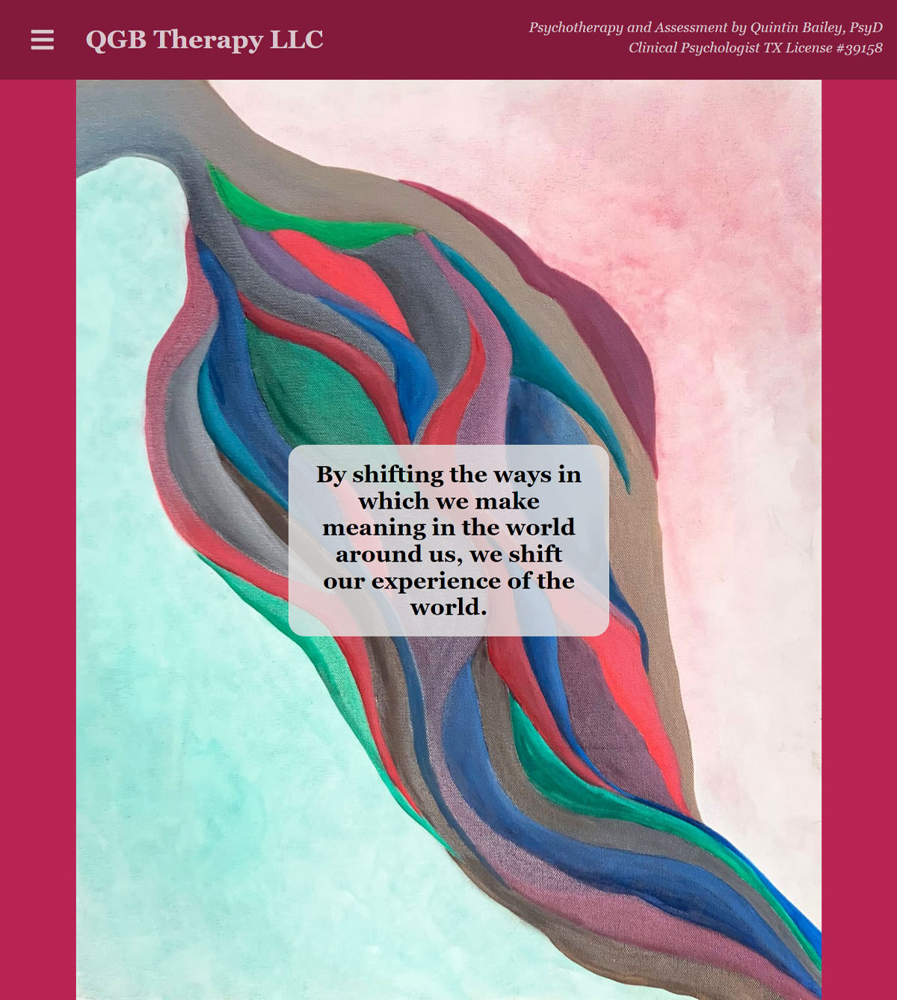

# QGB Therapy

[](https://opensource.org/licenses/MIT)

## Description

Dr. Quintin Bailey earned his PsyD in Clinical Psychology in November 2021 and was in need of a professional website to elaborate on his clinical services and allow potential new patients to reach out to him for consultation. Working closely with Dr. Bailey, I designed his website structure, user experience, and overall graphic design to compliment his vision. This website is built using React.js framework and is mobile responsive. I designed the CSS from scratch to refine my skills and maintain precise control over the layout. Within the first week of deploying the live site, Dr. Bailey was receiving form submissions from new patients seeking consultations.

## Table of Contents

- [User Story](#user-story)
- [Live Site](#live-site)
- [Technologies](#technologies)
- [Future Development](#future-development)
- [License](#license)
- [Contact](#contact)

## User Story
```
AS a recently certified psychologist
I WANT a website that informs potential new patients of my clinical services
SO THAT I can grow my practice and help more people
```

## Live Site

https://qgbtherapy.com/



## Technologies

- React.js
- JSX
- Node.js
- Custom CSS

## Future Development

As Dr. Bailey’s practice grows, I will continue to update the contents of the site and expand the user experience as needed.

## License

Licensed under the MIT License - https://opensource.org/licenses/MIT

## Contact

If you have any questions you can email me at williamcrownover1@gmail.com.

You can also check out my other work on GitHub at [WilliamCrownover](https://github.com/WilliamCrownover)